 
I caught fire coding. 

I never thought my dream was to be a Software Developer. During my school days, I tried myself with sports, science, (chess) and what not. But I kind of just felt meh. I yearned to learn more, yearned to learn something different. Then I joined college.

And that's when it happened; the spark I was missing ignited the instant I clicked play on my first Python tutorial video (The New Boston, if I remember correctly.). Since then, I can't get enough. Software development calls to all my passions; it incorporates creativity and problem solving and I'm allowed to break it to improve the code (in a separate Git branch, of course).

I like to automate things and find solution for real life problems using code. I'm highly fascinated by FOSS (Free and Open Source Software) and want to contribute to Open Source Community. When it comes to Web Development, I love applying responsive design principles and watching the web pages shrink into mobile screens and still look amazing. I am fascinated by the way back-end interacts with front-end in approximately no time and provides beautiful interactions to the clients.

My specialities include quickly learning new skills and programming languages, problem solving, domain driven design, website optimisation and API development (and optimisation). So far I have following tools and technologies under my belt: 
- Web Programming: Python, Django, Django-REST framework, Angular, TypeScript, JavaScript, HTML, CSS
- Alerting and Monitoring: ELK Stack 
- Version Control: Git/Github, Git/BitBucket
- Developer Productivity: Jira, Confluence, Linux

I can usually be found doing two things:
- Binge watching TV-shows/movies, or
- Coding (Learning as of now 😜️). 

I'm still enthusiastically grabbing onto any other programming languages, frameworks, or principles I can integrate into the coding web in my head. I’m also eager to meet other software engineers in the area, so feel free to connect!

## 📊 My Github Insights...
  
Following are some insights about my github profile, primarily consisting of my overall repository statistics and the languages I prefer to code in.
  

<table>
  <tr>
    <td></td>
    <td>
      <table>
        <tr><td></td></tr>
        <tr><td></td></tr>
      </table>
    </td>
  </tr>
</table>

## ✨ What I've been up to lately...
  
Following is a list of my recent activity on Github. It includes repositories I've shown interest in recent times, my recent commits, pull requests, issues, and more.

<table>
  <tr>
    <td></td>
    <td></td>
  </tr>
</table>

## 🧑🏻‍💻 Some of my other profiles...

Following are some of my other profiles on the internet. Feel free to connect with me on any of these platforms. 

<table>
  <tr>
    <td></td>
    <td></td>
  </tr>
</table>

## 🎖️ My Achievements so far...

Following are some of my habits and achievements so far. I'm always striving to learn more and improve myself. Hoping to add many more achievements to this list in the coming future.

<table>
  <tr>
    <td></td>
    <td></td>
  </tr>
</table>